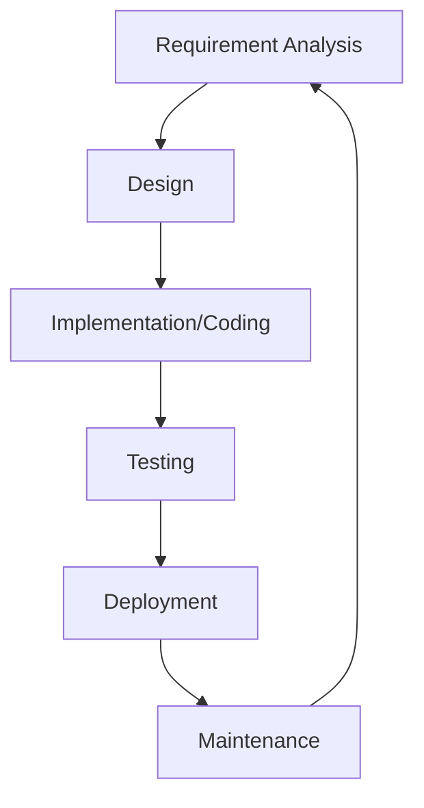

# Programming Methodology & Software Engineering Materials

Welcome to the refreshed repository dedicated to **Programming Methodology**. This resource is designed for students of Electronics and Telecommunications (EiT) and Informatics (Inf.), providing both theoretical knowledge and practical code examples.

---

## 📋 Spis treści / Table of Contents
1. [Wprowadzenie / Introduction](#-wprowadzenie--introduction)
2. [Cykl życia oprogramowania / SDLC](#-cykl-życia-oprogramowania--sdlc)
3. [Metodologie / Methodologies](#-metodologie--methodologies)
4. [Dobre praktyki / Best Practices](#-dobre-praktyki--best-practices-solid-dry-kiss)
5. [Testowanie / Testing](#-testowanie--quality-assurance)
6. [Projekty / Practical Projects](#-projekty--practical-projects)

---

## 📖 Wprowadzenie / Introduction
Metodologia programowania to nauka o metodach, technikach i narzędziach używanych do tworzenia wysokiej jakości oprogramowania. Obejmuje wszystko: od planowania projektu, przez standardy kodowania, aż po testowanie.

Programming methodology is the study of methods, techniques, and tools used to develop high-quality software. It encompasses everything from project planning and requirement analysis to coding standards and testing.

---

## 🔄 Cykl życia oprogramowania / SDLC
SDLC (Software Development Life Cycle) to proces stosowany w projektach programistycznych, opisujący etapy od analizy wymagań po utrzymanie systemu.

---

## 🏗 Metodologie / Methodologies

### Waterfall (Model Kaskadowy)
Liniowe i sekwencyjne podejście, w którym każda faza musi zostać zakończona przed rozpoczęciem następnej.
- **Zalety:** Jasno określone etapy, łatwe zarządzenie w małych projektach.
- **Wady:** Mała elastyczność, trudność w powrocie do poprzednich faz.

### Agile & Scrum (Metodyki Zwinne)
Iteracyjne podejście skupiające się na elastyczności, współpracy i informacji zwrotnej od klienta.

| Cecha / Feature | Waterfall | Agile |
| :--- | :--- | :--- |
| **Elastyczność** | Niska / Low | Wysoka / High |
| **Udział klienta** | Na początku i końcu | Ciągły / Continuous |
| **Dostarczanie** | Pojedyncze wydanie | Częste przyrosty / Sprints |
| **Ryzyko** | Wysokie (błędy na końcu) | Niskie (ciągłe testy) |

---

## ✨ Dobre praktyki / Best Practices (SOLID, DRY, KISS)
Pisanie kodu jest łatwe; pisanie kodu, który jest **łatwy w utrzymaniu**, jest trudne.

- **SOLID Principles:** 5 zasad projektowania obiektowego. [Czytaj więcej w SOLID.md](SOLID.md)
- **DRY (Don't Repeat Yourself):** Unikaj powtarzania kodu.
- **KISS (Keep It Simple, Stupid):** Unikaj niepotrzebnej złożoności.

---

## 🧪 Testowanie / Quality Assurance
- **Unit Testing (Testy jednostkowe):** Testowanie poszczególnych komponentów.
- **TDD (Test-Driven Development):** Pisanie testów *przed* kodem produkcyjnym.
- **Debugging:** Proces znajdowania i naprawiania błędów.

---

## 💻 Projekty / Practical Projects
Poniżej znajduje się lista projektów laboratoryjnych ilustrujących różne technologie i paradygmaty programowania.

### Sekcja 1: Programowanie niskopoziomowe (Assembly)
| Project | Description / Opis | Links |
| :--- | :--- | :--- |
| **Project 1** | MASM Assembly Template / Szablon programu | [View Project](ASK_LAB/) |
| **Project 1a** | Adding two numbers / Dodawanie liczb | [Code](ASK_LAB/Lab1/Lab1.asm) |
| **Project 1b** | Adding variables / Dodawanie zmiennych | [Code](ASK_LAB/Lab1/AddVariables.asm) |

### Sekcja 2: Aplikacje Desktopowe (C# Windows Forms)
| Project | Description / Opis | Links |
| :--- | :--- | :--- |
| **Project 2** | Windows Forms Components / Podstawowe komponenty | [View Project](WFA1/) |
| **Project 2a** | Console Calculator / Kalkulator konsolowy | [View Project](ConsoleCalculator/) |
| **Project 2b** | Quadratic Equation Solver / Równanie kwadratowe | [View Project](QuadraticEquationSolver/) |
| **Project 2c** | Math Quiz / Test matematyczny | [View Project](MathQuiz/) |
| **Project 2d** | Picture Viewer / Przeglądarka obrazów | [View Project](PictureViewer/) |
| **Project 2e** | Matching Game / Gra Memory | [View Project](MatchingGame/) |

### Sekcja 3: Specjalistyczne (MATLAB)
| Project | Description / Opis | Links |
| :--- | :--- | :--- |
| **Project 3** | Simple Digital Filter / Prosty filtr cyfrowy | [View Project](MATLAB-filters/) |

---
**Autor**: Artur Zacniewski  
**Groups**: **EiT** (II & IV sem.), **Inf.** (II sem.)

